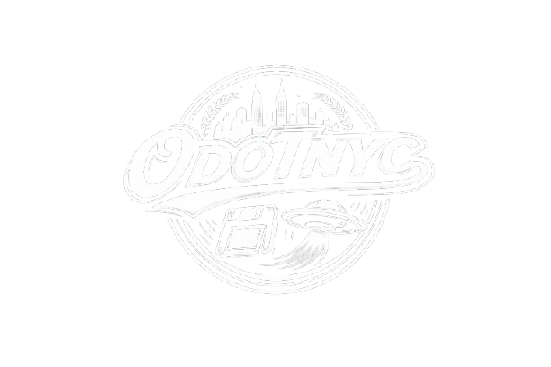

# AR-OdotNYC

### Open Source Software Documentation

**Presented as a RoboTechi Co. product**

---



## Overview

**AR-OdotNYC** is a mobile-responsive web-based augmented reality application built to allow users to scan supported **image markers** and trigger immersive **3D animated `.glb` model experiences** directly in the browser.

The software is designed as a lightweight, modern **WebAR** application that runs on mobile devices without requiring a native app install. It uses **MindAR** for image tracking, **A-Frame** for 3D scene rendering, and **glTF / GLB** assets for animated 3D content.

AR-OdotNYC is presented as a **RoboTechi Co.** product and can be positioned as an open-source foundation for marker-based augmented reality experiences used in branding, education, digital storytelling, events, product visualization, and maker-community interaction.

---

## Product Identity

**Product Name:** AR-OdotNYC
**Organization:** RoboTechi Co.
**Category:** Mobile WebAR Application
**Version:** 1.0
**Status:** Functional starter release / open-source foundation

### Product Vision

AR-OdotNYC was created to provide an accessible and visually engaging way for users to scan physical printed imagery and reveal digital augmented content. The project reflects RoboTechi Co.'s mission of blending **electronics, interactive media, web technology, and maker-driven experiences** into tools that are creative, educational, and future-facing.

---

## Core Features

* **Mobile responsive interface** for smartphone-based scanning
* **3-second branded loading screen** with centered glowing glitch logo
* **MindAR image tracking** for scanning multiple image markers
* **Support for multiple targets** using a single compiled `targets.mind` file
* **Animated `.glb` models** anchored to each unique marker
* **A-Frame scene rendering** for browser-based 3D AR presentation
* **On-screen scan guidance UI** to help users align markers
* **Status updates** when markers are found or lost
* **Open-source-friendly structure** for easy expansion and customization

---

## Technology Stack

AR-OdotNYC was built entirely as a browser-based experience using front-end web technologies.

### Primary Technologies

#### 1. HTML5

Used as the structural foundation of the application.

HTML defines:

* the loading screen
* the app UI overlays
* the A-Frame scene container
* the MindAR target entities
* asset declarations for models

#### 2. CSS3

Used for:

* mobile responsive layout
* splash screen design
* glowing and glitch logo effects
* scan card styling
* focus frame overlay
* transitions, animation effects, and UI polish

The visual presentation of AR-OdotNYC uses layered gradients, blur, glow, scanline styling, and animated glitch effects to create a futuristic presentation aligned with the RoboTechi Co. design language.

#### 3. JavaScript

Used to manage:

* 3-second splash timing
* MindAR startup flow
* target detection status messages
* banner visibility updates
* event binding for tracked markers
* prevention of unwanted touch gestures on mobile

#### 4. MindAR

MindAR is the image tracking engine that powers the marker-based augmented reality system.

MindAR handles:

* camera initialization
* image marker recognition
* tracking multiple image targets
* binding AR content to specific marker indexes

The application uses a compiled **`targets.mind`** file that contains the supported image targets.

#### 5. A-Frame

A-Frame is used as the 3D scene and entity framework.

A-Frame handles:

* scene creation
* camera setup
* lighting
* model rendering
* placement of models in relation to image targets

#### 6. GLB / glTF 3D Assets

Animated 3D models are loaded as `.glb` files.

These assets are used because they are:

* efficient for web delivery
* widely supported
* suitable for embedded animation
* ideal for mobile WebAR experiences

#### 7. A-Frame Extras (`animation-mixer`)

Used to automatically play the embedded animations contained inside supported `.glb` files.

---

## Software Architecture

AR-OdotNYC follows a simple, modular architecture that separates the experience into three major layers:

### 1. Presentation Layer

This includes all visible interface components:

* splash screen
* branding UI
* scan instructions
* focus frame
* detection status banner

### 2. Tracking Layer

This includes the MindAR image tracking system:

* `targets.mind`
* target indexes
* marker detection events
* target found / target lost handling

### 3. AR Content Layer

This includes the 3D assets and scene logic:

* `.glb` models
* A-Frame entities
* model transforms
* lighting and rendering
* animation playback

---

## How the App Works

### Step 1: App Loads

When the application starts, the user sees a branded splash screen with a centered glowing and glitching logo.

### Step 2: 3-Second Intro

The splash screen remains visible for 3 seconds to establish branding and create a polished entry experience.

### Step 3: Splash Hides

After the timer completes, the splash screen fades out.

### Step 4: MindAR Starts

The JavaScript then starts the MindAR image tracking system and activates the device camera.

### Step 5: User Scans Marker

The user points the camera at one of the supported marker images.

### Step 6: Target Detection

If the marker matches one of the compiled targets in `targets.mind`, MindAR triggers the corresponding `targetFound` event.

### Step 7: AR Content Appears

The `.glb` model linked to that marker's `targetIndex` is rendered into the AR scene and anchored to the detected image.

### Step 8: Animation Plays

If the model includes an embedded animation, the `animation-mixer` component plays it automatically.

### Step 9: UI Updates

The interface updates the status text and shows a small target banner to confirm which marker was found.

---

## Marker-to-Model Mapping

The system maps markers to models based on the order the marker images were compiled into `targets.mind`.


## Why MindAR Was Chosen

MindAR was selected because it is well suited for browser-based marker AR experiences and works well for multi-target image tracking.

### Benefits of MindAR for this Project

* no native app required
* image target tracking directly in browser
* suitable for mobile devices
* good fit for branded AR campaigns
* integrates well with A-Frame
* easy to expand for multi-marker experiences

---

## Why A-Frame Was Chosen

A-Frame was selected because it offers a fast and readable way to build 3D web scenes.

### Benefits of A-Frame

* simple HTML-based scene structure
* strong compatibility with glTF / GLB workflows
* fast prototyping for WebAR
* easy to understand for open-source contributors
* good balance of simplicity and power

---

## Why GLB Was Chosen

The `.glb` format was chosen because it is a practical and efficient format for browser-based 3D applications.

### Benefits of GLB

* compact file structure
* supports embedded textures
* supports embedded animation
* easy to deliver through web projects
* good performance compared to many alternatives

---

## UX and Design Decisions

AR-OdotNYC was intentionally built with a strong branded interface rather than a plain demo-style scanner.

### Key UX Decisions

#### Branded Splash Screen

The splash screen establishes product identity immediately and helps the app feel like a packaged product instead of a raw technical prototype.

#### Glowing / Glitch Logo

The glow and glitch effect gives the software a futuristic, cyber-tech personality that aligns with RoboTechi Co.'s design direction.

#### Focus Frame

The focus frame helps users understand where to place their target image when scanning.

#### Status Messaging

The live status label provides immediate feedback for better usability.

#### Bottom Scan Card

The scan card keeps instructions visible without overwhelming the screen.

---

## Mobile Responsiveness

The application was built to respond well across modern mobile screens.

### Responsive Considerations

* `viewport-fit=cover` for better fullscreen behavior
* safe-area padding for modern mobile devices
* scalable logo and UI components
* adaptive focus frame sizing
* compact UI cards for smaller screen widths
* touch behavior adjustments for mobile browsing

This makes the application suitable for iPhone and Android browser-based scanning workflows.

---

## Open Source Positioning

AR-OdotNYC can be released as an open-source starter platform for image-marker WebAR experiences.

### Suggested Open Source Use Cases

* educational AR demos
* maker fair activations
* interactive flyers and posters
* product packaging AR experiences
* art, design, and portfolio augmentation
* brand storytelling and campaign work
* classroom and workshop tools

### Open Source Benefits

* community extensibility
* easy feature iteration
* reusability for other RoboTechi Co. AR products
* educational value for developers and makers learning WebAR

---

## Deployment Notes

Because AR-OdotNYC uses camera access, deployment should be handled in a secure browser environment.

### Deployment Requirements

* HTTPS in production
* camera permissions allowed
* optimized asset sizes for mobile performance
* reliable hosting of `.mind` and `.glb` files

---

## Performance Considerations

To keep the software running well on mobile devices, the following practices are recommended:

* keep `.glb` assets lightweight
* reduce oversized texture maps
* avoid unnecessary polygon density
* test each target image for strong feature detection
* avoid too many simultaneous tracked targets
* keep UI overlays visually light

---

## Limitations in Version 1

Version 1 is a solid branded starter build, but it has natural first-release limitations.

### Current Limitations

* no per-target control buttons yet
* no analytics or usage tracking
* no CMS or database integration
* marker labels are static placeholders
* no audio interaction yet
* no model-specific info panels yet
* no target-management dashboard

---

## Recommended Future Versions

### Version 1.1

* custom marker names in UI
* per-target action buttons
* improved loading progress display

### Version 1.2

* sound effects or voiceover triggers
* animated instruction modal
* model-specific information popups

### Version 2.0

* backend for content management
* remote asset updates
* analytics dashboard
* campaign-based marker packs
* expanded RoboTechi Co. AR toolkit

---

## Potential RoboTechi Co. Positioning Statement

**AR-OdotNYC by RoboTechi Co.** is a mobile-first WebAR platform that transforms printed imagery into interactive augmented reality experiences using browser-based image tracking and animated 3D content.

It represents RoboTechi Co.'s approach to merging design, immersive technology, and accessible creative tooling into open, adaptable software for modern makers, brands, and educators.

---

## Suggested README Intro Copy

```md
# AR-OdotNYC

AR-OdotNYC is a mobile-responsive image-marker WebAR application by RoboTechi Co. It allows users to scan supported image targets and reveal animated `.glb` models directly in the browser using MindAR and A-Frame.

Built as an open-source starter platform, AR-OdotNYC is designed for creators, educators, brands, and developers looking to build immersive marker-based augmented reality experiences without requiring a native mobile app.
```

---

## Suggested License Direction

For open-source release, RoboTechi Co. could consider one of the following:

* **MIT License** for broad reuse and simple adoption
* **Apache 2.0** if patent language and contributor clarity are desired


## Credits

### Presented By

**RoboTechi Co.**
IOT • Web • Electronics 

### Built With

* HTML5
* CSS3
* JavaScript
* MindAR
* A-Frame
* A-Frame Extras
* GLB / glTF workflow

---

## Final Summary

AR-OdotNYC is a strong version 1 WebAR foundation that combines:

* branded presentation
* mobile-responsive design
* image marker scanning
* animated 3D model rendering
* open-source-friendly structure

As a RoboTechi Co. product, it can serve as both a practical AR software tool and a public-facing example of how maker-driven technology can be transformed into interactive branded experiences for the web.


Link: https://odotofrva.github.io/OdotNYC-AR/
